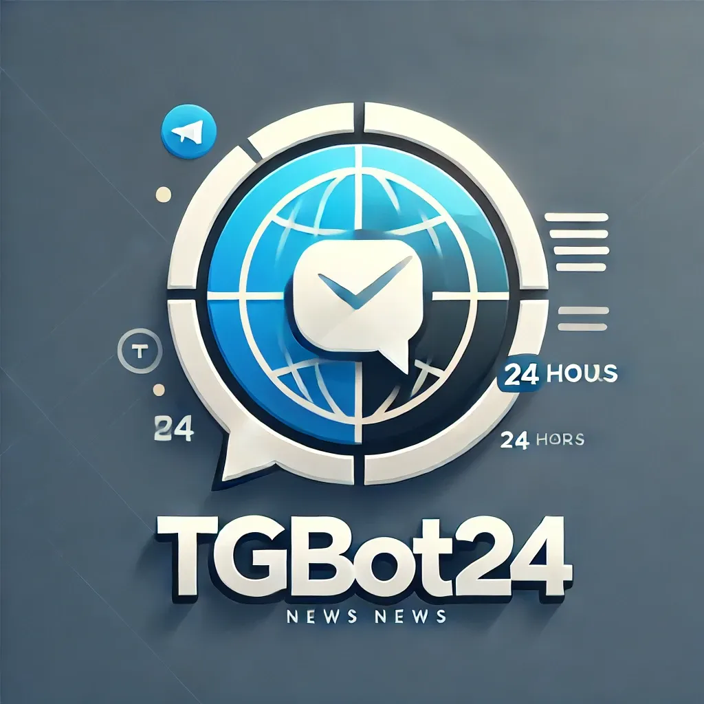
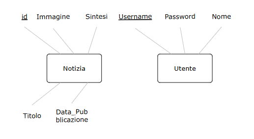
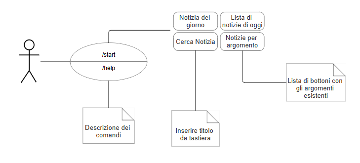

# TGBot24

## Introduzione

Questo documento descrive il progetto **TGBot24**, un bot di Telegram progettato per fornire notizie sintetizzate agli utenti in modo semplice e accessibile. Il bot esegue un **web scraping** del sito **TGCOM24** per raccogliere notizie aggiornate, e le invia agli utenti tramite Telegram, utilizzando il sistema di **sintesi delle notizie già fornito dal sito TGCOM24**.

## Contesto

**TGBot24** è destinato a studenti, professionisti e appassionati di attualità che desiderano rimanere aggiornati sulle principali notizie in modo semplice, veloce e interattivo. L'utente riceve notizie sintetizzate e immagini rappresentative direttamente tramite Telegram, senza la necessità di navigare su più fonti.

## Obiettivi del Software

- Fornire un accesso rapido e facile alle notizie più recenti e rilevanti.
- Automatizzare la raccolta e l'invio delle notizie tramite Web Scraping, senza necessità di sintesi aggiuntive grazie al sito TGCOM24.
- Offrire una piattaforma interattiva e user-friendly per la consultazione delle notizie.
- Consentire agli utenti di ricevere aggiornamenti personalizzati e sintetici in modo efficiente.

## **Requisiti del Sistema**

### **Requisiti non funzionali (qualità)**

- Risposta rapida per ogni richiesta.
- Il sistema deve essere **scalabile**, in grado di gestire numerosi utenti simultaneamente senza compromettere le prestazioni.
- Le notizie estratte devono essere **accurate e aggiornate**, mantenendo l'integrità delle informazioni fornite.
- L'interfaccia utente deve essere semplice e intuitiva per garantire un'esperienza ottimale.

## **Funzionalità**

- Il bot invia **notizie sintetizzate** agli utenti, combinando testo e immagini estratti dal sito **TGCOM24**.
- Gli utenti possono ricevere aggiornamenti automatici o personalizzati, scegliendo le **categorie di notizie** di loro interesse.
- Gli utenti possono cercare notizie tramite **parole chiave**, ricevendo un elenco di notizie correlate.
- Il sistema tiene traccia della cronologia delle notizie inviate e delle interazioni degli utenti nel database.

## **Architettura del Sistema**

1. **Telegram Bot**
    - Il bot è l'interfaccia principale con gli utenti, ricevendo richieste tramite Telegram e inviando le notizie estratte.
2. **API Telegram**
    - Utilizzata per la comunicazione tra il bot e gli utenti, gestisce l'invio e la ricezione di messaggi.
3. **Web Scraper**
    - Implementato con **Jsoup**, il web scraper estrae notizie da **TGCOM24**, comprese sintesi, titoli, e immagini.
4. **Database**
    - Il database MySQL memorizza:
        - Le notizie estratte (titoli, sintesi, immagini, URL).
        - Le informazioni sugli utenti iscritti.
        - La cronologia delle interazioni degli utenti con il bot.

## **Tecnologie**

**Linguaggi di Programmazione:**

- **Java**: Utilizzato per sviluppare la logica del bot e per eseguire il web scraping delle notizie.

**Database Management System (DBMS):**

- **MySQL**: Sistema di gestione del database per memorizzare notizie, dati utenti, e log delle interazioni.

**API Telegram:**

- L'**API Telegram** è utilizzata per gestire l'interazione tra il bot e gli utenti.

**Librerie:**

- **TelegramBots (Java)**: Libreria per interagire con l'API Telegram, semplificando l'invio di messaggi e la gestione dei comandi.
- **Jsoup (Java)**: Libreria per il web scraping, utilizzata per estrarre notizie dal sito **TGCOM24**.

## **Schema ER del Database**

## **Schema Logico del Database**

| **Utenti** | `ID` (PK), `Username`, `Password`, `Nome` |
| --- | --- |
| **Notizie** | `ID` (PK), `Titolo`, `Sintesi`, `URL_Immagine`, `DataPubblicazione`, `Argomento` |

## **Interfaccia utente e casi d'uso**

## Conclusione

Con l'aggiornamento di **TGBot24**, il progetto offre un accesso rapido e facile alle notizie sintetizzate direttamente dal sito **TGCOM24**, rendendo l'esperienza dell'utente ancora più diretta ed efficiente.
